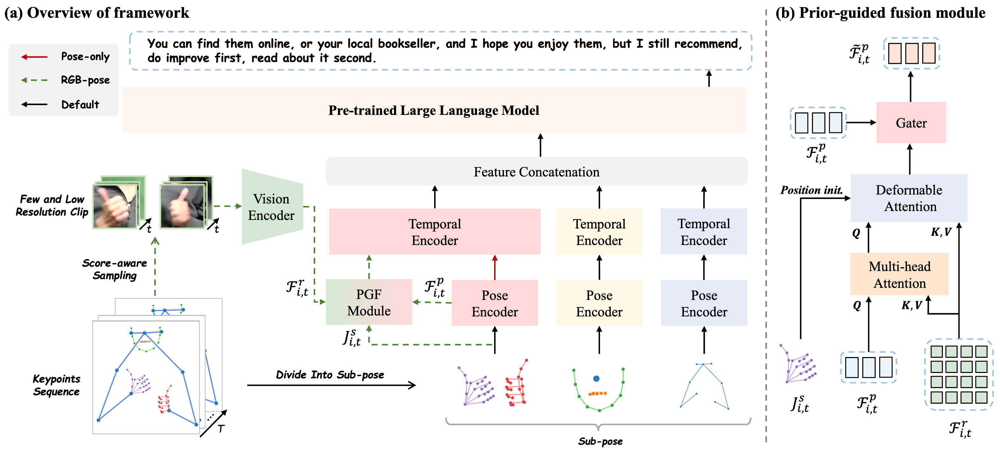

<h3 align="center"><a href="" style="color:#9C276A">
Uni-Sign: Toward Unified Sign Language Understanding at Scale</a></h3>
<h5 align="center"> 
If our project helps you, please give us a star🌟 on GitHub, that would motivate us a lot!
</h2>

<h5 align="center">

[](https://arxiv.org/abs/2501.15187) 
[](https://huggingface.co/datasets/ZechengLi19/CSL-News)
[](https://pan.baidu.com/s/17W6kIreNMHYtD4y2llKmDg?pwd=ncvo) 

[](https://paperswithcode.com/sota/sign-language-recognition-on-ms-asl?p=uni-sign-toward-unified-sign-language)
[](https://paperswithcode.com/sota/sign-language-recognition-on-wlasl100?p=uni-sign-toward-unified-sign-language)
[](https://paperswithcode.com/sota/sign-language-recognition-on-wlasl-2000?p=uni-sign-toward-unified-sign-language)
[](https://paperswithcode.com/sota/sign-language-recognition-on-csl-daily?p=uni-sign-toward-unified-sign-language)
[](https://paperswithcode.com/sota/gloss-free-sign-language-translation-on-csl?p=uni-sign-toward-unified-sign-language)
[](https://paperswithcode.com/sota/gloss-free-sign-language-translation-on-2?p=uni-sign-toward-unified-sign-language)
[](https://paperswithcode.com/sota/gloss-free-sign-language-translation-on-3?p=uni-sign-toward-unified-sign-language)
</h5>



## 💥 News
[2025/1/25] This [paper](https://openreview.net/pdf?id=0Xt7uT04cQ) is accepted by `ICLR 2025` 🎉🎉!

[2025/2/24] Release CSL-News dataset and code implementation.

## 🛠️ Installation
We suggest to create a new conda environment. 
```bash
# create environment
conda create --name Uni-Sign python=3.9
conda activate Uni-Sign
# install other relevant dependencies
pip install -r requirements.txt
```

## 📖 Preparation
Please follow the instructions provided in [DATASET.md](./docs/DATASET.md) for data preparation.

## 🔨 Training & Evaluation
All scripts must be executed within the Uni-Sign directory.
### Training
**Stage 1**: pose-only pre-training.
```bash
bash ./script/train_stage1.sh
```
**Stage 2**: RGB-pose pre-training.
```bash
bash ./script/train_stage2.sh
```
**Stage 3**: downstream fine-tuning.
```bash
bash ./script/train_stage3.sh
```

### Evaluation
After completing stage 3 fine-tuning, performance evaluation on a single GPU can be performed using the following command:
```bash
bash ./script/eval_stage3.sh
```

## 👨‍💻 Todo
- [x] Release CSL-News dataset
- [x] Release Uni-Sign implementation 

## 📮 Contact
If you have any questions, please feel free to contact Zecheng Li (lizecheng19@gmail.com). Thank you.

## 👍 Acknowledgement
The codebase of Uni-Sign is adapted from [GFSLT-VLP](https://github.com/zhoubenjia/GFSLT-VLP). We are also grateful for the following projects our Uni-Sign arise from:
* 🤟[SSVP-SLT](https://github.com/facebookresearch/ssvp_slt): a excellent sign language translation framework! 
* 🏃️[MMPose](https://github.com/open-mmlab/mmpose): an open-source toolbox for pose estimation.
* 🤠[FUNASR](https://github.com/modelscope/FunASR): a high-performance speech-to-text toolkit.


## 📑 Citation
If you find Uni-Sign useful for your research and applications, please cite using this BibTeX:
```
@article{li2025uni,
  title={Uni-Sign: Toward Unified Sign Language Understanding at Scale},
  author={Li, Zecheng and Zhou, Wengang and Zhao, Weichao and Wu, Kepeng and Hu, Hezhen and Li, Houqiang},
  journal={arXiv preprint arXiv:2501.15187},
  year={2025}
}
```

2000
Top-K Accuracies (Per Instance): {1: 66.71299743652344, 3: 89.71508026123047, 5: 93.78040313720703, 7: 95.23975372314453, 10: 96.4906234741211}
Top-K Accuracies (Per Class): {1: 61.93925828305651, 3: 89.90558242813486, 5: 93.8337330971274, 7: 95.25878553764433, 10: 96.09685912510228}

1000
Top-K Accuracies (Per Instance): {1: 70.73561096191406, 3: 91.41791534423828, 5: 94.776123046875, 7: 95.73561096191406, 10: 97.01493072509766}
Top-K Accuracies (Per Class): {1: 68.73102827708092, 3: 92.34741799215485, 5: 95.09970257338679, 7: 96.0244191559981, 10: 96.8725699383594}

300
Top-K Accuracies (Per Instance): {1: 75.74850463867188, 3: 93.41317749023438, 5: 96.25749206542969, 7: 96.85629272460938, 10: 97.60478973388672}
Top-K Accuracies (Per Class): {1: 75.19569990158224, 3: 93.76296464531761, 5: 96.47929442047091, 7: 97.18714512832162, 10: 97.77538042243927}

100
Top-K Accuracies (Per Instance): {1: 75.968994140625, 3: 92.63565826416016, 5: 94.57363891601562, 7: 95.73643493652344, 10: 96.51162719726562}
Top-K Accuracies (Per Class): {1: 76.19524405506884, 3: 92.75657071339174, 5: 94.52962035878184, 7: 95.94806007509389, 10: 97.01188986232793}